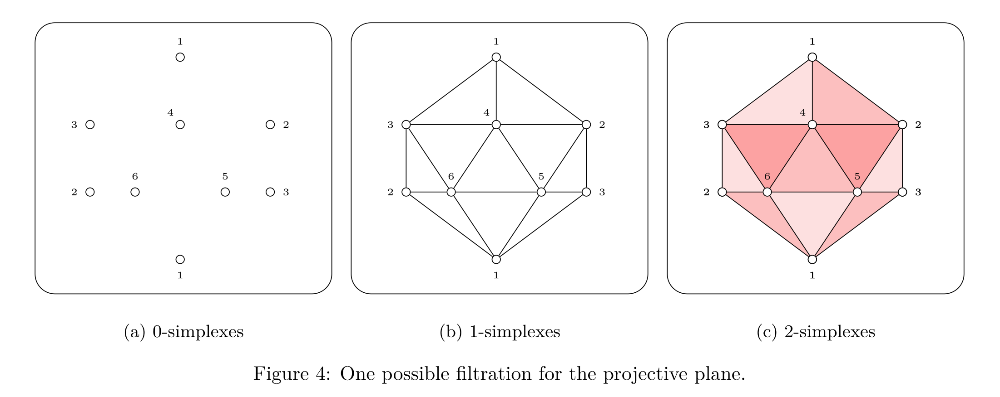

# Topological Persistence - INF556

This project was developed for the *INF556 - Topological Data Analysis* course at Ecole Polytechnique. 



The full report is available [here](Report.pdf).

## How build/run locally

```shell
$ mkdir build && cd build && cmake .. && make
$ ./TD5 ../objects/filtrations/3-ball-filtration.txt
```

References
----------
1. Edelsbrunner, Herbert. **A Short Course in Computational Geometry and Topology** . Springer, 2014.

2. Simplical Homology.  Available at \< https://www.fields.utoronto.ca/programs/scientific/04-05/data_sets/parent.pdf >

3. The Real Projective Plane Triangulated.  Available at \< http://www.math.jhu.edu/~jmb/note/rp2tri.pdf >
